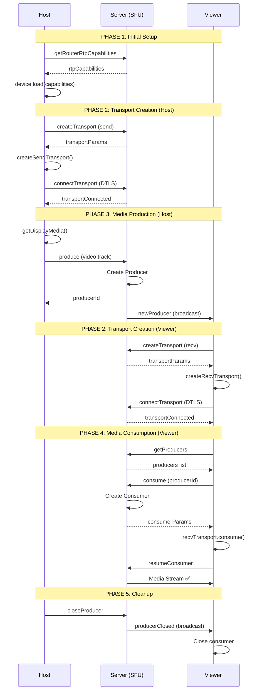

# Mediasoup Complete Workflow Documentation

> [!NOTE]
> Mediasoup is a Selective Forwarding Unit (SFU) - the server receives media from the host and forwards it to viewers without transcoding. Think of it as a smart media router.

```
Host (Producer) → Mediasoup Server → Viewers (Consumers)
     [Sends media]    [Forwards]      [Receive media]
```

---

## 📋 Complete Workflow Step-by-Step

### PHASE 1: Initial Setup (Both Host & Viewer)

#### 1️⃣ Get Router RTP Capabilities

**Location:** `useMediasoupWebRTC.ts:52-64`

**What happens:**

```javascript
// FE sends:
socket.emit('getRouterRtpCapabilities', { roomId })

// BE receives (rooms.gateway.ts:659):
@SubscribeMessage('getRouterRtpCapabilities')
  - Creates router if doesn't exist
  - Gets router's supported codecs (VP8, VP9, H264, Opus)

// BE sends back:
socket.emit('routerRtpCapabilities', { rtpCapabilities })

// FE receives:
socket.on('routerRtpCapabilities', (data) => {
  device.load({ routerRtpCapabilities: data.rtpCapabilities })
})
```

**Purpose:** The client learns what audio/video formats the server supports.

**Logs:**
```
[FE-MEDIASOUP] 📤 Requesting router RTP capabilities for room: abc123
[MEDIASOUP] 🎛️ Get router RTP capabilities for room abc123
[MEDIASOUP] 📤 Sent router RTP capabilities
[FE-MEDIASOUP] ✅ Received router RTP capabilities, loading device...
[FE-MEDIASOUP] ✅ Device loaded successfully
```

---

### PHASE 2: Transport Creation

> [!IMPORTANT]
> Transports are bidirectional pipes for media:
> - **Send Transport** (host → server): For sending media
> - **Receive Transport** (server → viewer): For receiving media

#### 2️⃣ Create WebRTC Transport

**Location:** `useMediasoupWebRTC.ts:215-255` (event handler)

**What happens:**

```javascript
// FE sends:
socket.emit('createTransport', {
  roomId: 'abc123',
  direction: 'send' // or 'recv'
})

// BE receives (rooms.gateway.ts:675):
@SubscribeMessage('createTransport')
  - Creates WebRTC transport on router
  - transportId = `${client.id}-${direction}`
    Example: "socketId123-send"

// BE creates transport with:
{
  id: transport.id,              // mediasoup's internal ID
  iceParameters: {...},          // For ICE connection
  iceCandidates: [...],          // Server's network addresses
  dtlsParameters: {...}          // For DTLS encryption
}

// BE sends back:
socket.emit('transportCreated', {
  direction: 'send',
  transportId: 'socketId123-send',
  ...transportParams
})

// FE receives and creates local transport:
const transport = device.createSendTransport({
  id: data.id,
  iceParameters: data.iceParameters,
  iceCandidates: data.iceCandidates,
  dtlsParameters: data.dtlsParameters,
})
```

**Purpose:** Creates the media pipe between client and server.

- **Host creates:** Send transport (to send screen/audio)
- **Viewer creates:** Receive transport (to receive stream)

**Logs:**
```
[FE-MEDIASOUP] 🚗 Creating send transport...
[MEDIASOUP] 🚗 Create send transport for room abc123 from socketId123
[MEDIASOUP] ✅ Created send transport socketId123-send
[FE-MEDIASOUP] ✅ Send transport created
```

---

#### 3️⃣ Connect Transport

**Location:** `useMediasoupWebRTC.ts:229` (transport.on('connect'))

**What happens:**

```javascript
// FE: When transport needs to connect, it fires event
transport.on('connect', async ({ dtlsParameters }, callback) => {
  // FE sends DTLS params to server:
  socket.emit('connectTransport', {
    roomId,
    transportId: 'socketId123-send',
    dtlsParameters
  })

  // BE receives (rooms.gateway.ts:701):
  @SubscribeMessage('connectTransport')
    - Finds transport by ID
    - Calls: await transport.connect({ dtlsParameters })
    - This establishes the encrypted connection

  // BE sends back:
  socket.emit('transportConnected', { transportId })

  // FE receives and completes connection:
  callback() // Tells transport "connection successful"
})
```

**Purpose:** Establishes the encrypted WebRTC connection (DTLS handshake).

**Logs:**
```
[MEDIASOUP] 🔗 Connect transport socketId123-send from socketId123
[MEDIASOUP] ✅ Transport socketId123-send connected
```

---

### PHASE 3: Media Production (HOST ONLY)

#### 4️⃣ Produce Media (Host Sends Video/Audio)

**Location:**
- FE: `useMediasoupWebRTC.ts:77-108` (produceMedia function)
- FE: `useMediasoupWebRTC.ts:236-244` (transport produce event)

**What happens:**

```javascript
// HOST: Gets screen share stream
const stream = await navigator.mediaDevices.getDisplayMedia({
  video: true,
  audio: true
})

// HOST: For each track (video, audio), produces to transport
const videoTrack = stream.getVideoTracks()[0]

// FE: Transport fires 'produce' event
sendTransport.on('produce', async ({ kind, rtpParameters }, callback) => {
  // FE sends track info to server:
  socket.emit('produce', {
    roomId: 'abc123',
    transportId: 'socketId123-send',
    kind: 'video',           // 'video' or 'audio'
    rtpParameters: {...}     // Codec params, encoding settings
  })

  // BE receives (rooms.gateway.ts:723):
  @SubscribeMessage('produce')
    - Finds send transport
    - Creates producer: await transport.produce({ kind, rtpParameters })
    - Stores producer: roomRouter.producers.set(producerId, producer)
    - Returns producer ID

  // BE broadcasts to ALL OTHER clients in room:
  socket.to(roomId).emit('newProducer', {
    producerId: 'producer-abc-123',
    kind: 'video'
  })

  // BE sends back to host:
  socket.emit('produced', {
    kind: 'video',
    id: 'producer-abc-123'
  })

  // FE receives producer ID:
  callback({ id: serverProducerId })
})
```

**Purpose:** Host sends media tracks to server. Server stores them and notifies viewers.

> [!TIP]
> **Key Point:** The server now has the host's video/audio streams ready to forward to viewers!

**Logs:**
```
[FE-MEDIASOUP] 🎬 Starting media production...
[FE-MEDIASOUP] 📹 Producing video track...
[MEDIASOUP] 🎬 Produce video for room abc123 from socketId123
[MEDIASOUP] ✅ Producer created: producer-abc-123 (video)
[MEDIASOUP] 📤 Sent newProducer event to room abc123
```

---

### PHASE 4: Media Consumption (VIEWER ONLY)

#### 5️⃣ Get Available Producers (Viewer Discovers Streams)

**Location:** `useMediasoupWebRTC.ts:63` & `useMediasoupWebRTC.ts:390-407`

**What happens:**

```javascript
// VIEWER: After device loads, asks for available producers
socket.emit('getProducers', { roomId: 'abc123' })

// BE receives (rooms.gateway.ts:745):
@SubscribeMessage('getProducers')
  - Gets all producers in room
  - Returns list: ['producer-abc-123', 'producer-def-456']

// BE sends back:
socket.emit('producers', {
  producers: [
    { id: 'producer-abc-123', kind: 'video' },
    { id: 'producer-def-456', kind: 'audio' }
  ]
})

// FE receives:
socket.on('producers', (data) => {
  // For each producer, start consuming
  data.producers.forEach(({ id }) => {
    consumeMedia(id)
  })
})
```

**Purpose:** Viewer discovers what media streams are available from the host.

**Logs:**
```
[FE-MEDIASOUP] 📤 Viewer requesting existing producers
[MEDIASOUP] Get producers for room abc123
[FE-MEDIASOUP] 📋 Received X existing producers
```

---

#### 6️⃣ Consume Media (Viewer Receives Stream)

**Location:**
- FE: `useMediasoupWebRTC.ts:105-208` (consumeMedia function)
- BE: `rooms.gateway.ts:753` (consume handler)

**What happens:**

```javascript
// VIEWER: Requests to consume a specific producer
socket.emit('consume', {
  roomId: 'abc123',
  transportId: 'viewerSocketId-recv',
  producerId: 'producer-abc-123',
  rtpCapabilities: device.rtpCapabilities  // What viewer can decode
})

// BE receives (rooms.gateway.ts:753):
@SubscribeMessage('consume')
  - Finds viewer's receive transport
  - Checks if viewer can consume this producer
  - Creates consumer on transport:
    const consumer = await transport.consume({
      producerId,
      rtpCapabilities,
      paused: true  // Start paused
    })
  - Stores consumer

// BE sends back:
socket.emit('consumed', {
  id: 'consumer-xyz-789',      // Consumer ID
  producerId: 'producer-abc-123',
  kind: 'video',
  rtpParameters: {...}          // How to decode it
})

// VIEWER: Creates local consumer
const consumer = await recvTransport.consume({
  id: data.id,
  producerId: data.producerId,
  kind: data.kind,
  rtpParameters: data.rtpParameters,
})

// VIEWER: Adds track to stream
const stream = new MediaStream([consumer.track])
setRemoteStream(stream)  // Display in <video> element

// VIEWER: Resume consumer to start receiving
socket.emit('resumeConsumer', {
  roomId,
  consumerId: 'consumer-xyz-789'
})

// BE receives and unpauses:
consumer.resume()
// Media now flows: Host → Server → Viewer! 🎉
```

**Purpose:** Viewer receives and displays the host's video/audio stream.

**Logs:**
```
[FE-MEDIASOUP] 📤 Requesting consume for producer-abc-123
[MEDIASOUP] Consume request - Room: abc123, ProducerId: producer-abc-123
[MEDIASOUP] Consumer created successfully: consumer-xyz-789
[FE-MEDIASOUP] ✅ Consumer created, adding track to stream
[FE-MEDIASOUP] 📤 Resuming consumer
[MEDIASOUP] Resume consumer: consumer-xyz-789
```

---

### PHASE 5: Cleanup (Leave/Disconnect)

#### 7️⃣ Close Producer (Host Stops Sharing)

**Location:** `useMediasoupWebRTC.ts:478-504` (stopScreenShare)

**What happens:**

```javascript
// HOST: Stops screen share
socket.emit('closeProducer', {
  roomId: 'abc123',
  producerId: 'producer-abc-123'
})

// BE receives (rooms.gateway.ts:756):
@SubscribeMessage('closeProducer')
  - Closes producer: producer.close()
  - Removes from map

// BE broadcasts to viewers:
socket.to(roomId).emit('producerClosed', {
  producerId: 'producer-abc-123'
})

// VIEWER: Receives event and cleans up consumer
socket.on('producerClosed', (data) => {
  const consumer = consumers.get(data.producerId)
  consumer.close()
  // Remove track from stream
})
```

**Logs:**
```
[MEDIASOUP] Close producer: producer-abc-123
[FE-MEDIASOUP] 📥 Producer closed: producer-abc-123
```

---

#### 8️⃣ Cleanup User Media (Reconnection) ⭐

**Location:** `mediasoup.service.ts:365-400`

**What happens:**

```javascript
// When user reconnects (new socket ID):
const closedProducerIds = this.mediasoupService.cleanupUserMedia(
  roomId,
  oldSocketId
)

// Function:
cleanupUserMedia(roomId, oldSocketId):
  1. Find all transports with oldSocketId prefix
     Example: "oldSocket123-send", "oldSocket123-recv"

  2. Close each transport:
     transport.close()

  3. Close ALL producers (can't track ownership):
     producers.forEach(producer => producer.close())

  4. Return closed producer IDs

  5. Notify viewers:
     closedProducerIds.forEach(id => {
       socket.to(roomId).emit('producerClosed', { producerId: id })
     })
```

**Purpose:** When host reconnects (page reload), clean up old connections before creating new ones.

**Logs:**
```
[CLEANUP] 🧹 Starting media cleanup for room abc123, oldSocket oldSocket123
[CLEANUP] 🚗 Closing transport for reconnected user: oldSocket123-send
[CLEANUP] 🎬 Closing producer due to user reconnect: producer-abc-123
[CLEANUP] ✅ Cleaned up 2 transports and 2 producers
```

---

#### 9️⃣ Close Room (Host Leaves) ⭐⭐

**Location:** `mediasoup.service.ts:402-434`

**What happens:**

```javascript
// When host leaves/disconnects permanently:
this.mediasoupService.closeRoom(roomId)

// Function:
closeRoom(roomId):
  1. Get room router and count resources

  2. Close all consumers (viewer connections):
     consumers.forEach(consumer => consumer.close())
     consumers.clear()

  3. Close all producers (host streams):
     producers.forEach(producer => producer.close())
     producers.clear()

  4. Close all transports (all pipes):
     transports.forEach(transport => transport.close())
     transports.clear()

  5. Close router (mediasoup room):
     router.close()

  6. Remove room from map:
     this.routers.delete(roomId)
```

> [!CAUTION]
> **THIS IS WHERE WORKERS ARE FREED!** When the room closes, all mediasoup resources are released, and the worker can handle new rooms.

**Logs:**
```
[DISCONNECT] 🧹 Cleaning up mediasoup resources for room abc123
[CLOSE-ROOM] 🗑️ Starting room cleanup for abc123
[CLOSE-ROOM] 🎧 Closed 3 consumers
[CLOSE-ROOM] 🎬 Closed 2 producers
[CLOSE-ROOM] 🚗 Closed 5 transports
[CLOSE-ROOM] ✅ Room abc123 fully closed
```

---

## 📊 Summary Table

| Function                 | Who Calls   | Direction                 | What It Does                           |
|--------------------------|-------------|---------------------------|----------------------------------------|
| getRouterRtpCapabilities | Both        | Client → Server → Client  | Get supported codecs (VP8, Opus, etc.) |
| createTransport          | Both        | Client → Server → Client  | Create send/recv pipe                  |
| connectTransport         | Both        | Client → Server → Client  | Establish DTLS encryption              |
| produce                  | Host only   | Client → Server           | Send video/audio tracks to server      |
| getProducers             | Viewer only | Client → Server → Client  | Get list of available streams          |
| consume                  | Viewer only | Client → Server → Client  | Receive specific stream                |
| resumeConsumer           | Viewer only | Client → Server           | Unpause stream (start flowing)         |
| closeProducer            | Host only   | Client → Server → Viewers | Stop producing stream                  |
| cleanupUserMedia         | N/A         | Server-side               | Clean up on reconnect                  |
| closeRoom                | N/A         | Server-side               | Free all workers on room close         |

---

## 🔄 Complete Flow Diagram



---

## 🎯 Workflow Overview

### ┌─────────────────────────────────────────────────────────────┐
### │                     HOST WORKFLOW                            │
### └─────────────────────────────────────────────────────────────┘

1. Get RTP Capabilities → Load device
2. Create Send Transport → Connect it
3. Get screen stream → Produce video → Produce audio
4. Server broadcasts "newProducer" to all viewers

### ┌─────────────────────────────────────────────────────────────┐
### │                    VIEWER WORKFLOW                           │
### └─────────────────────────────────────────────────────────────┘

1. Get RTP Capabilities → Load device
2. Create Receive Transport → Connect it
3. Get Producers list → For each producer:
   - Consume producer → Add track to stream → Resume consumer
4. Display stream in `<video>` element

### ┌─────────────────────────────────────────────────────────────┐
### │              RECONNECTION/CLEANUP WORKFLOW                   │
### └─────────────────────────────────────────────────────────────┘

**User Reconnects:**
- → `cleanupUserMedia(oldSocketId)`
- → Close old transports
- → Close old producers
- → Notify viewers
- → User creates new transports/producers

**Host Leaves:**
- → `closeRoom(roomId)`
- → Close all consumers, producers, transports
- → Close router
- → **Workers are freed and ready for new rooms!**

---

## 🔑 Key Takeaways

> [!IMPORTANT]
> 1. **SFU Architecture**: Server forwards media without transcoding - acts as a smart router
> 2. **Transports**: Bidirectional WebRTC pipes (Send for host, Receive for viewers)
> 3. **Producer/Consumer Model**: Host produces media, viewers consume it
> 4. **Resource Cleanup**: `closeRoom()` is where workers are freed when viewers leave

This is the complete mediasoup workflow! The key understanding: `closeRoom()` is where workers are cleaned up when viewers leave (by closing the room when the host leaves).
