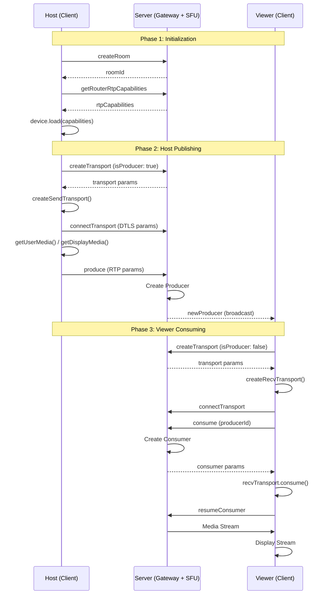
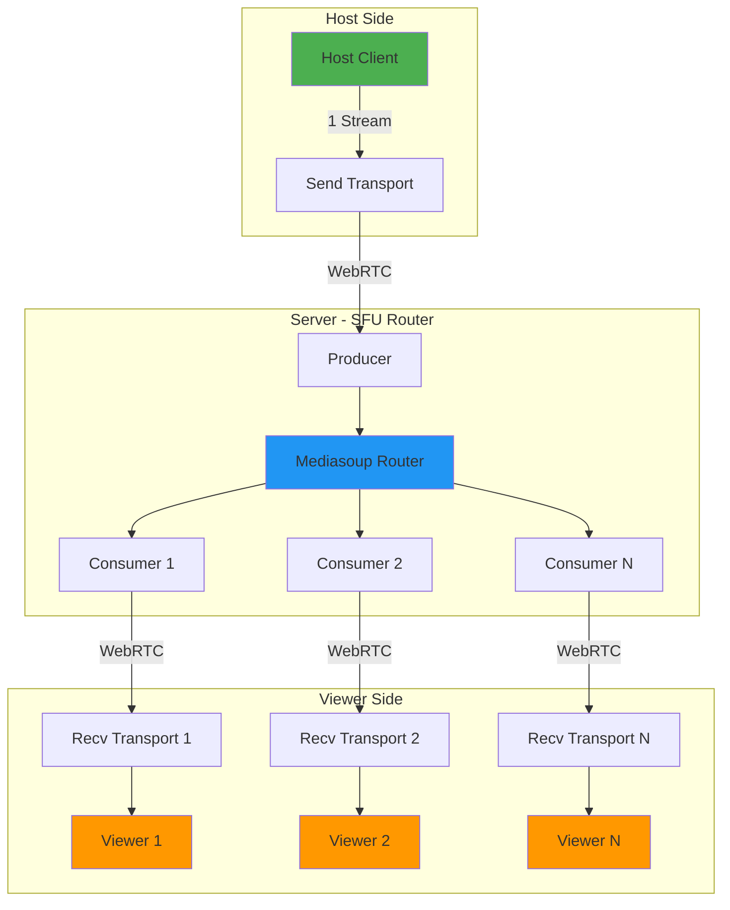

# Mediasoup Architecture Documentation

> [!NOTE]
> Tài liệu này mô tả chi tiết về kiến trúc **SFU (Selective Forwarding Unit)** sử dụng WebRTC và Mediasoup để giải quyết vấn đề quá tải băng thông và CPU.

---

## 📋 Tổng Quan

Hệ thống được chia thành hai phần chính:
- **Server-side**: NestJS + Mediasoup 
- **Client-side**: React + Mediasoup-Client

---

## 1️⃣ Server-Side Methods

> Files: `mediasoup.service.ts`, `rooms.gateway.ts`

### Core Methods

| Phương Thức | File | Chức Năng |
|------------|------|-----------|
| `createRoomRouter()` | mediasoup.service.ts | **Tạo môi trường phòng**: Chọn Worker (tiến trình Mediasoup C++) và khởi tạo Router - trái tim của phòng, quản lý tất cả luồng media (Producers/Consumers) |
| `getRouterRtpCapabilities()` | mediasoup.service.ts | **Cung cấp cấu hình**: Trả về danh sách codec và tham số RTP mà Router hỗ trợ, cần thiết cho client cấu hình Device |
| `createWebRtcTransport()` | mediasoup.service.ts | **Thiết lập kết nối**: Tạo WebRtcTransport cho client (Host/Viewer) để gửi/nhận media, quản lý kết nối ICE/DTLS/SRTP |
| `connectTransport()` | mediasoup.service.ts | **Hoàn tất kết nối**: Hoàn tất handshake DTLS với thông số từ client, bước cuối để Transport sẵn sàng |
| `produce()` | mediasoup.service.ts | **Xuất bản luồng**: Tạo Producer đại diện cho luồng media từ client lên server |
| `consume()` | mediasoup.service.ts | **Tiêu thụ luồng**: Tạo Consumer để gửi media từ server xuống Viewer - cơ chế SFU forwarding |
| `resumeConsumer()` | mediasoup.service.ts | **Khởi động luồng**: Unpause Consumer để bắt đầu gửi gói tin media |
| `closeProducer()` `closeConsumer()` `closeRoom()` | mediasoup.service.ts | **Dọn dẹp tài nguyên**: Đóng các luồng, transport, hoặc toàn bộ router khi ngắt kết nối |

---

## 2️⃣ Client-Side Methods

> File: `useMediasoupWebRTC.ts`

### Core Methods

| Phương Thức | File | Chức Năng |
|------------|------|-----------|
| `device.load()` | useMediasoupWebRTC.ts | **Khởi tạo Device**: Load Device với routerRtpCapabilities từ server, xác định codec hỗ trợ |
| `device.createSendTransport()` | useMediasoupWebRTC.ts | **Tạo Transport Gửi**: Khởi tạo Transport client-side để gửi media lên server |
| `device.createRecvTransport()` | useMediasoupWebRTC.ts | **Tạo Transport Nhận**: Khởi tạo Transport client-side để nhận media từ server |
| `sendTransport.produce()` | useMediasoupWebRTC.ts | **Kích hoạt gửi**: Gửi MediaStreamTrack qua Transport, trigger sự kiện `on('produce')` |
| `recvTransport.consume()` | useMediasoupWebRTC.ts | **Kích hoạt nhận**: Bắt đầu nhận luồng media từ server dựa trên producerId |

---

## 3️⃣ Workflow Chi Tiết

> [!IMPORTANT]
> Luồng làm việc sử dụng **Socket.IO** cho signaling và **WebRTC/Mediasoup** cho media transport

### Phase 1: Khởi Tạo (Initialization)

#### 🏠 Host Tạo Phòng
1. **Client**: Host kết nối Socket.IO → gửi event `createRoom`
2. **Server**: Tạo phòng trong `rooms.service` → gọi `mediasoupService.createRoomRouter()`

#### 📱 Khởi Tạo Client Device
1. **Client**: Gửi event `getRouterRtpCapabilities`
2. **Server**: Gọi `mediasoupService.getRouterRtpCapabilities()` → trả về capabilities
3. **Client**: Tạo Device → gọi `device.load()` với capabilities nhận được

---

### Phase 2: Host Xuất Bản (Publishing)

#### 🔄 Bước 1: Tạo Transport Gửi
1. **Client**: Host gửi event `createTransport` (với `isProducer: true`)
2. **Server**: Gọi `mediasoupService.createWebRtcTransport()` → trả về Transport params (ID, ICE/DTLS info)
3. **Client**: Gọi `device.createSendTransport()`

#### 🔗 Bước 2: Kết Nối Transport
1. **Client**: Trigger `sendTransport.on('connect')` → gửi DTLS params qua event `connectTransport`
2. **Server**: Gọi `mediasoupService.connectTransport()` → hoàn tất kết nối

#### 📹 Bước 3: Tạo Producer
1. **Client**: Host bắt đầu chia sẻ (VD: `navigator.mediaDevices.getDisplayMedia()`)
2. **Client**: Gọi `sendTransport.produce()` cho video/audio track
3. **Client**: Event `sendTransport.on('produce')` → gửi RTP params qua event `produce`
4. **Server**: Gọi `mediasoupService.produce()` → tạo và lưu Producer
5. **Server**: Broadcast event `newProducer` đến tất cả Viewers

---

### Phase 3: Viewer Tiêu Thụ (Consuming)

#### 🔄 Bước 1: Tạo Transport Nhận
1. **Client**: Viewer nhận `newProducer` → gửi event `createTransport` (với `isProducer: false`)
2. **Server**: Gọi `mediasoupService.createWebRtcTransport()` → trả về Transport params
3. **Client**: Gọi `device.createRecvTransport()`

#### 🔗 Bước 2: Kết Nối Transport
- Tương tự Phase 2 - Bước 2

#### 📺 Bước 3: Tạo Consumer và Nhận Media
1. **Client**: Viewer gửi event `consume` với `producerId` của Host
2. **Server**: Gọi `mediasoupService.consume()` → tạo Consumer liên kết với Producer
3. **Server**: Trả về Consumer params (ID, RTP)
4. **Client**: Gọi `recvTransport.consume()` → tạo MediaStreamTrack cục bộ
5. **Client**: Gửi event `resumeConsumer`
6. **Server**: Gọi `mediasoupService.resumeConsumer()` → bắt đầu streaming
7. **Client**: Hiển thị luồng video

---

## 4️⃣ Sơ Đồ Kiến Trúc

---

## 5️⃣ Mô Hình SFU

### 🎯 Ưu Điểm SFU

> [!TIP]
> **Tối ưu hóa băng thông cho Host**: Host chỉ gửi **1 luồng** duy nhất lên server, thay vì gửi N luồng cho N viewers.

| Thành Phần | Vai Trò |
|-----------|---------|
| **Signaling (Socket.IO)** | Trao đổi thông số kỹ thuật (capabilities, DTLS params, RTP params) giữa Client và Server |
| **Host Producer** | Gửi 1 luồng media lên SFU Router qua Send Transport |
| **SFU Router** | Chuyển tiếp gói tin (không decode/mix) - tạo Consumer riêng cho mỗi Viewer |
| **Viewer Consumer** | Nhận luồng media riêng từ SFU qua Receive Transport |

---

## 🔒 Resource Management

> [!WARNING]
> Luôn đảm bảo cleanup resources khi:
> - Host/Viewer ngắt kết nối
> - Phòng bị đóng
> - Lỗi xảy ra trong quá trình streaming

### Cleanup Methods
- `closeProducer()` - Đóng luồng xuất bản
- `closeConsumer()` - Đóng luồng tiêu thụ  
- `closeRoom()` - Đóng toàn bộ router
